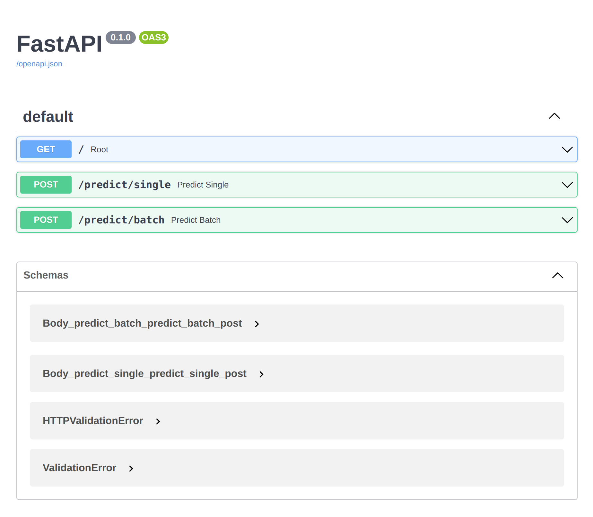
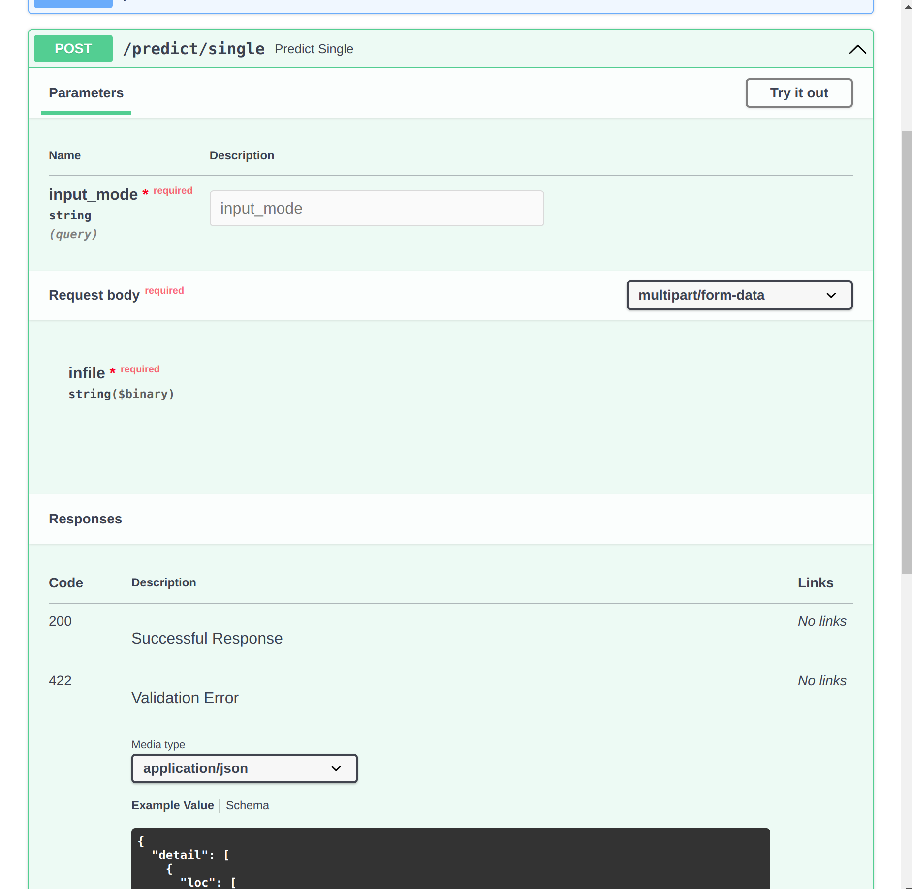
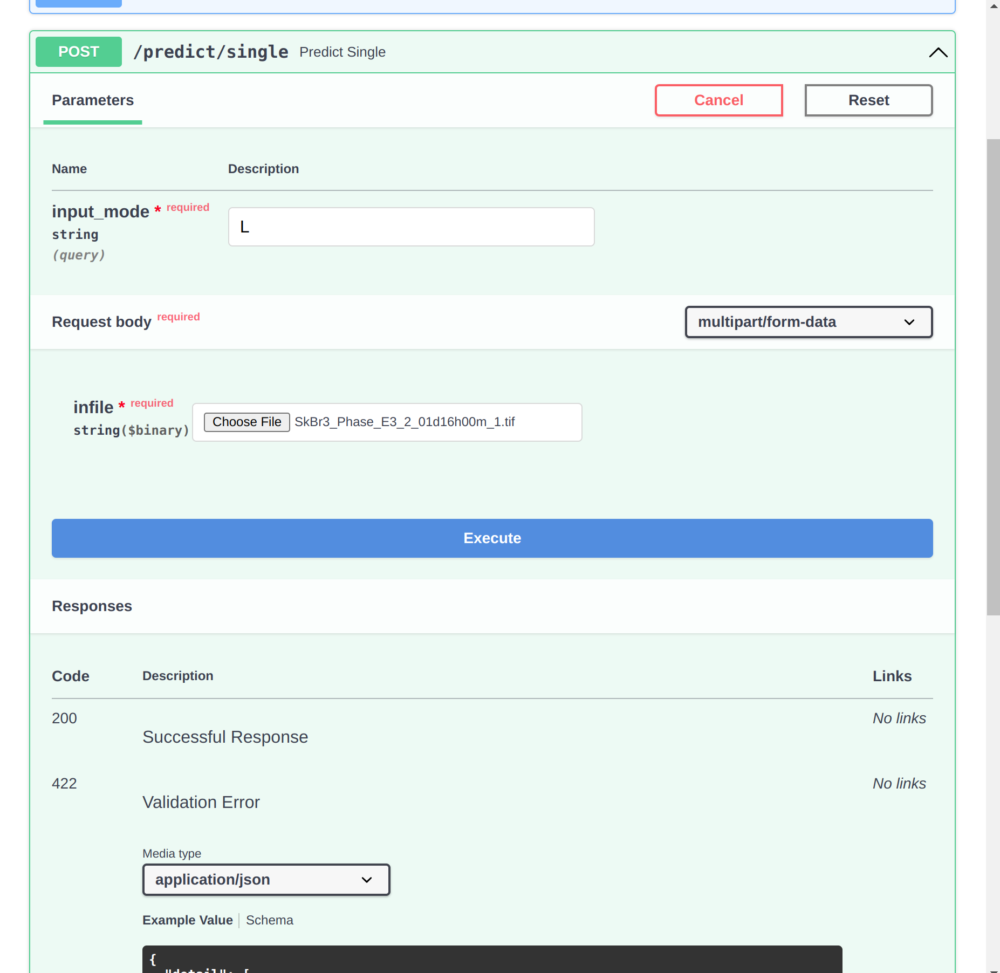
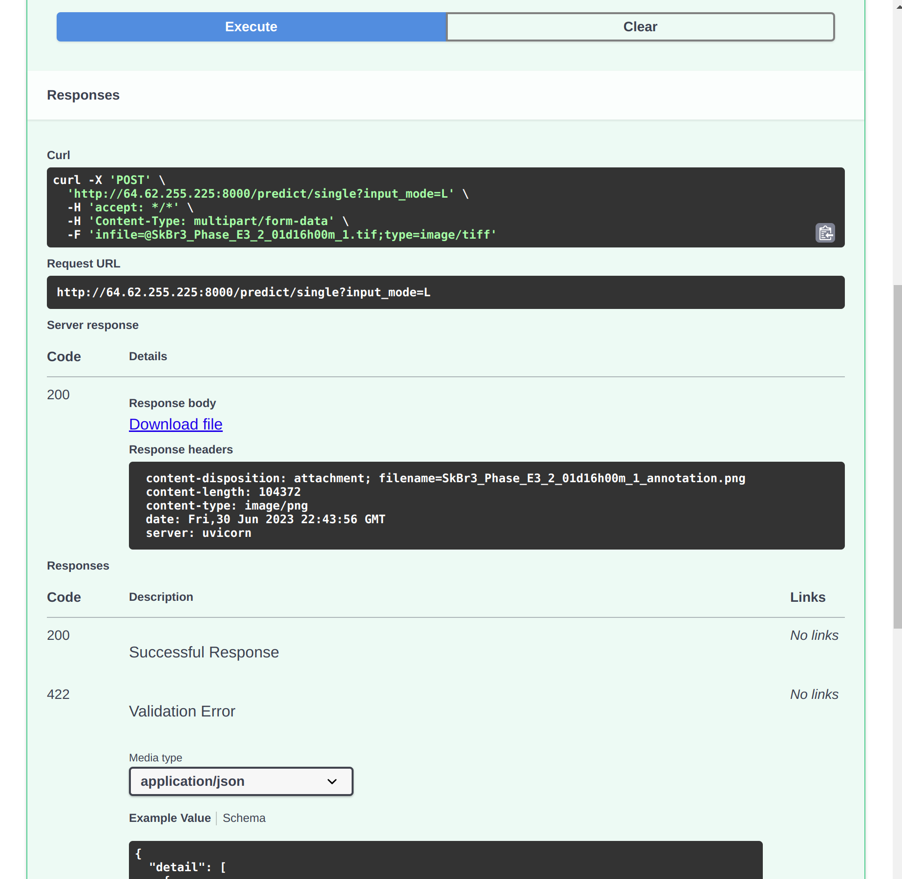
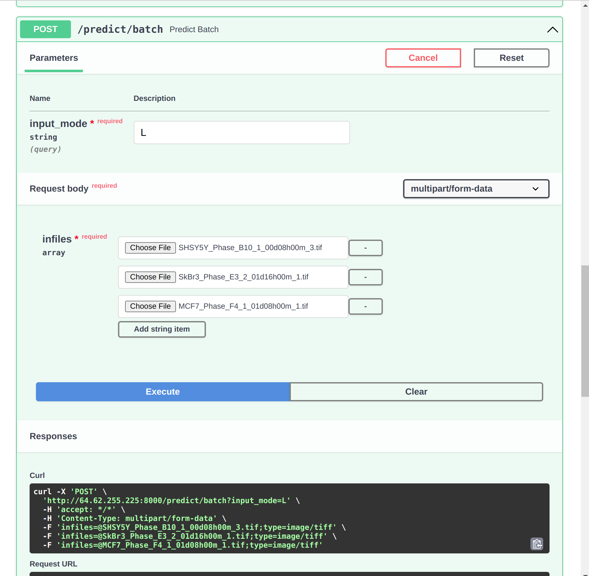
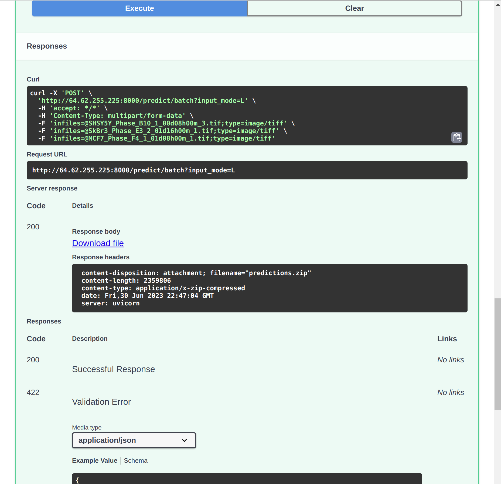
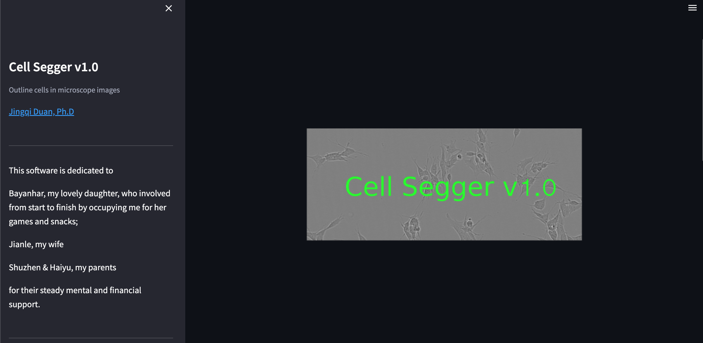
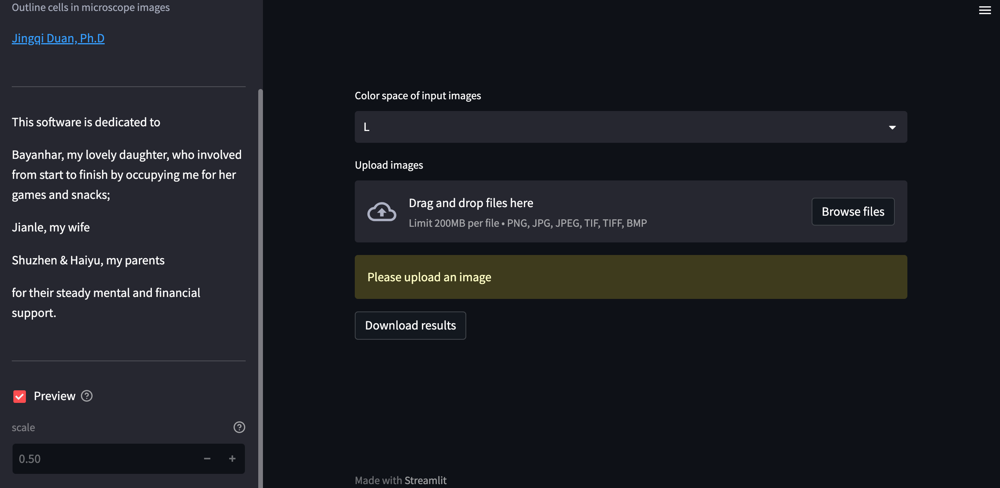
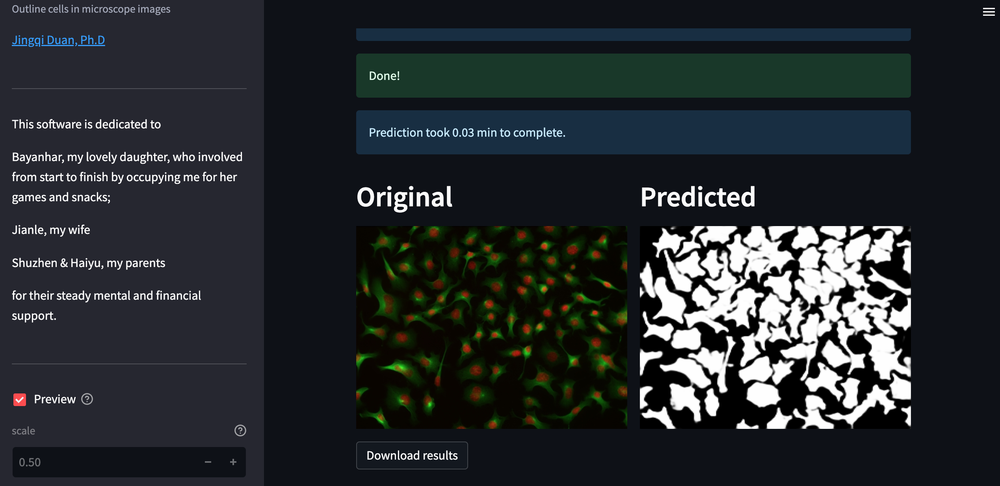

# Cells Segger 1.0
_Jingqi Duan, Ph.D._
_July 2, 2023_

Cell Segger is a program to predict cell boundaries for cells in microscope images. It uses a pretrained UNet model to perform the prediction. In the version 1.0, only images in grayscale or color mode are accepted for an accurate prediction for them, for example, DIC and fluorescence microscope images; Images have single channel. Fluorescence images were usually captured in multi-channel mode and channels should be merged; The output image which is in binary contains predicted masks for cells in the input image; Together with output image, there will be a csv file named ‘images.csv’ which contains image metadata and run length encoded predicted masks, and a plain text file named ‘welcome.txt’ containing my greetings and contact information. 

Cell Segger can be used as a stand-alone program. It has also been deployed on Paperspace, where users can access it in two ways: [Swagger API](http://64.62.255.225:8000/docs) in any internet browser, [Streamlit UI](http://64.62.255.225:8501).

## A stand-alone Cell Segger

### Installation (on Ubuntu22.04)

Installation is only tested on Ubuntu. Other OS will be tested in future.

#### 1. Install Docker 
```console
sudo /bin/bash docker_setup.sh
```
Verify that the Docker Engine installation is successful.
```console
sudo docker run hello-world
```
The detailed information can be found [Docker documentation](https://docs.docker.com/engine/install/ubuntu/).

#### 2. Install Cell Segger
```console
git clone https://github.com/duanjingqi/cells-instance-segmentation-API.git
cd ./cells-instance-segmentation_API
python3 -m pip install -r requirements.txt
echo "export \$SEGGER_DIR=$(pwd)" >> $HOME/.bashrc
```
#### 3. Test if Cell Segger can be run or not
```console
pytest
```
Five scripts are tested. It is expected that the two fail the test, 'test_single_prediction' and 'test_batch_prediction', which are the tests for the API. They won't affect the stand-alone usage. And the Cell Segger API runs with no problem. It is the API test scripts are not good. They will be resolved in future versions. 

### Predict with Cells Segger
1. Display the predict.py help message

```console
python $SEGGER_DIR/predict.py -h
```

2. Predict for a single image 

```console
python $SEGGER_DIR/predict.py -image foo.png -dest output_dir
```

3. Predict in batch

```console
python $SEGGER_DIR/predict.py -files foo.txt -dest output_dir
```

Feed single image to '_image' argument. For batch prediction, add file path of the images to be used to a txt file, e.g. foo.txt, feed the file to '_files' argument. Predicted cell masks are in a png image for each input image in 'output_dir'.

## Swagger API
The Cell Segger API looks like the following. For single image prediction, use ‘/predict/single’; and batch prediction, use ‘/predict/batch’.



1. Cell Segger prediction on a single image 

Collapse the ‘/predict/single’ tab, hit ‘Try it out’. 



In the input_mode field, fill ‘L’ for grayscale image, ‘RGB’ for color image. Upload image to the infile field. Hit ‘Execute’.



If the prediction is successful, the response code will be ‘200’. Hit ‘Download file’ to save the image containing the predicted masks to a local file. 



2. Cell Segger batch prediction
Collapse the ‘/predict/batch’ tab, hit ‘Try it out’. Upload images to the infile fields. Hit ‘Execute’.



After prediction is done, download the predicted images. 



## Streamlit UI

The Cell Segger UI looks like the following.



If users want to preview the image and its predicted masks, check the ‘Preview’ radio. It will take extra time to display the result. Specify the color space of the input image from the drop down menu, upload the images, Cell segger will automatically start to do the prediction.



An example of a predicted result for a color image looks like the following. Users can download the results. 

